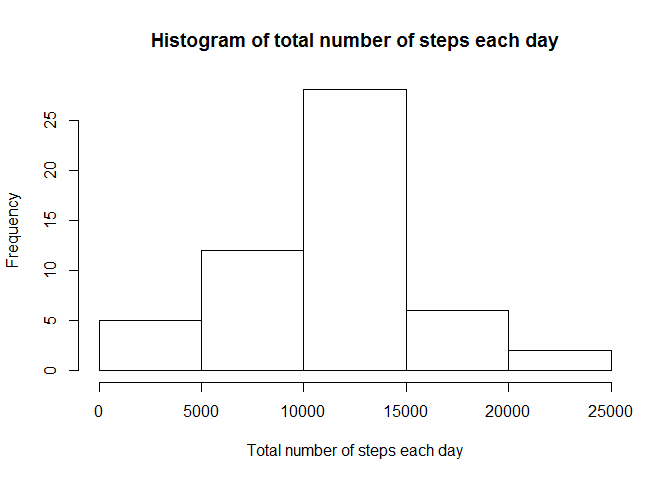
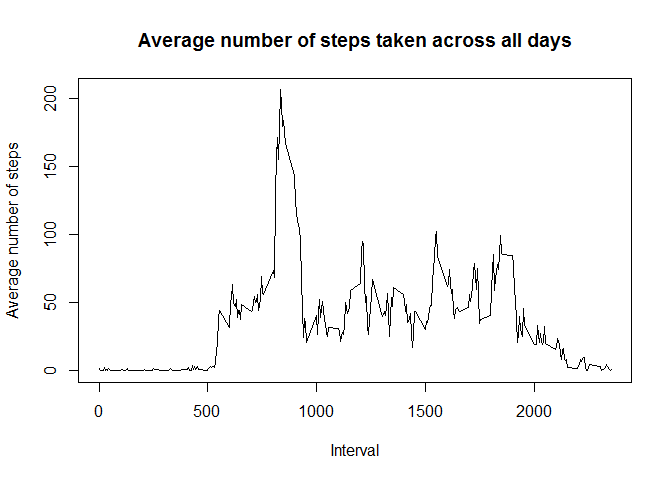
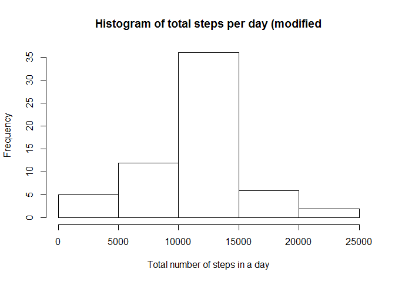

# Reproducible Research: Peer Assessment 1


## Loading and preprocessing the data

```r
library(dplyr)
```

```
## 
## Attaching package: 'dplyr'
## 
## The following object is masked from 'package:stats':
## 
##     filter
## 
## The following objects are masked from 'package:base':
## 
##     intersect, setdiff, setequal, union
```

```r
library(ggplot2)
library(knitr)
if (!file.exists("activity.csv"))  {
    dataset_url <- "https://d396qusza40orc.cloudfront.net/repdata%2Fdata%2Factivity.zip"
    download.file(dataset_url, "activity.zip")
    unzip("activity.zip")
    file.remove("activity.zip")
}
data <- read.csv("activity.csv")
```


## What is mean total number of steps taken per day?

```r
dataByDate <- group_by(na.omit(data),date)
totalStepsInDay <- summarize(dataByDate, total = sum(steps))
hist(totalStepsInDay$total,xlab="Total number of steps each day",main="Histogram of total number of steps each day")
```

 

```r
mean(totalStepsInDay$total)
```

```
## [1] 10766.19
```

```r
median(totalStepsInDay$total)
```

```
## [1] 10765
```


## What is the average daily activity pattern?

```r
stepsInInterval <- aggregate(steps ~ interval, data, mean)
plot(stepsInInterval$interval, stepsInInterval$steps, type='l',main="Average number of steps taken across all days",xlab="Interval",ylab="Average number of steps")
```

 

```r
stepsInInterval[which.max(stepsInInterval$steps),]
```

```
##     interval    steps
## 104      835 206.1698
```

## Inputing missing values

```r
length(which(is.na(data$steps)))
```

```
## [1] 2304
```

```r
modifiedData <- data
for (i in 1:nrow(modifiedData))  {
    if (is.na(modifiedData$steps[i]))  {
        intervalValue <- modifiedData$interval[i]
        stepsValue <- stepsInInterval[stepsInInterval$interval == intervalValue,]
        modifiedData$steps[i] <- stepsValue$steps
    }
}
modifiedDataDbD <- aggregate(steps ~ date, modifiedData, sum)
head(modifiedDataDbD)
```

```
##         date    steps
## 1 2012-10-01 10766.19
## 2 2012-10-02   126.00
## 3 2012-10-03 11352.00
## 4 2012-10-04 12116.00
## 5 2012-10-05 13294.00
## 6 2012-10-06 15420.00
```

```r
hist(modifiedDataDbD$steps, main = "Histogram of total steps per day (modified", xlab = "Total number of steps in a day")
```

 

```r
mean(modifiedDataDbD$steps)
```

```
## [1] 10766.19
```

```r
median(modifiedDataDbD$steps)
```

```
## [1] 10766.19
```

```r
mean(totalStepsInDay$total)
```

```
## [1] 10766.19
```

```r
median(totalStepsInDay$total)
```

```
## [1] 10765
```


## Are there differences in activity patterns between weekdays and weekends?

```r
modifiedData['typeOfDay'] <- weekdays(as.Date(modifiedData$date))
modifiedData$typeOfDay[modifiedData$typeOfDay  %in% c('Saturday','Sunday') ] <- "weekend"
modifiedData$typeOfDay[modifiedData$typeOfDay != "weekend"] <- "weekday"

modifiedData$typeOfDay <- as.factor(modifiedData$typeOfDay)
modifiedDataStepsByInterval <- aggregate(steps ~ interval + typeOfDay, modifiedData, mean)

# plot
qplot(interval, 
      steps, 
      data = modifiedDataStepsByInterval, 
      type = 'l', 
      geom=c("line"),
      xlab = "Interval", 
      ylab = "Number of steps", 
      main = "") +
  facet_wrap(~ typeOfDay, ncol = 1)
```

 
